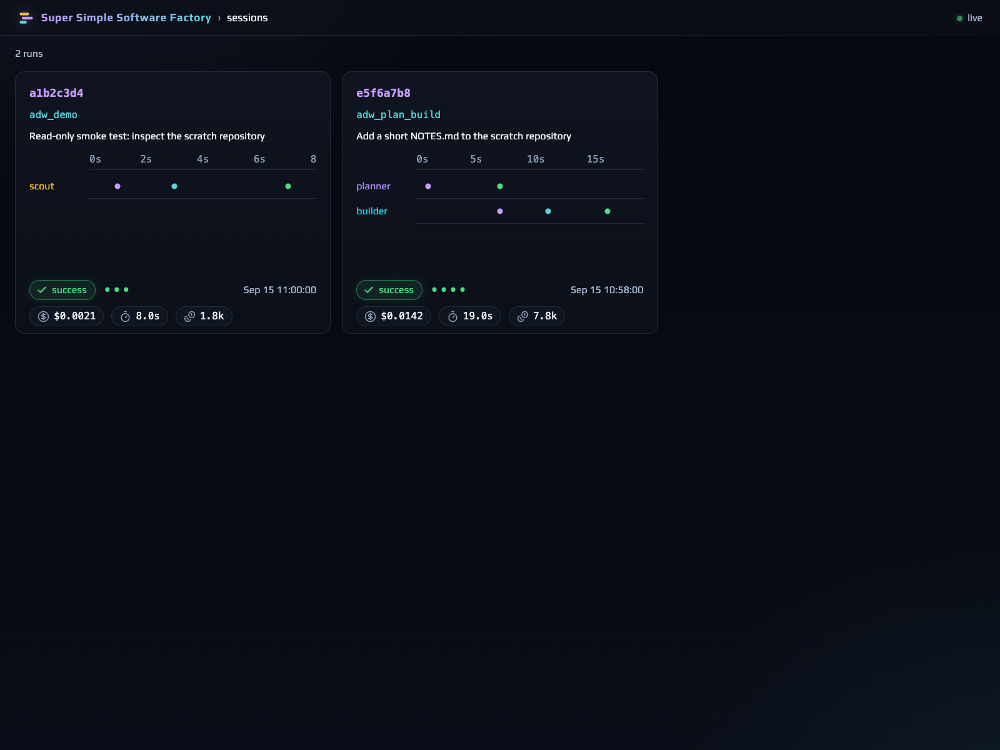
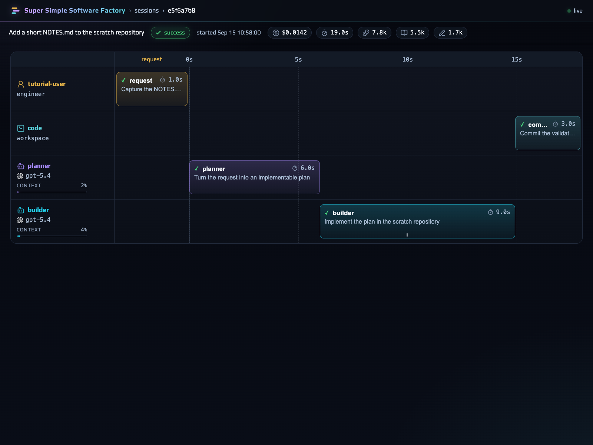
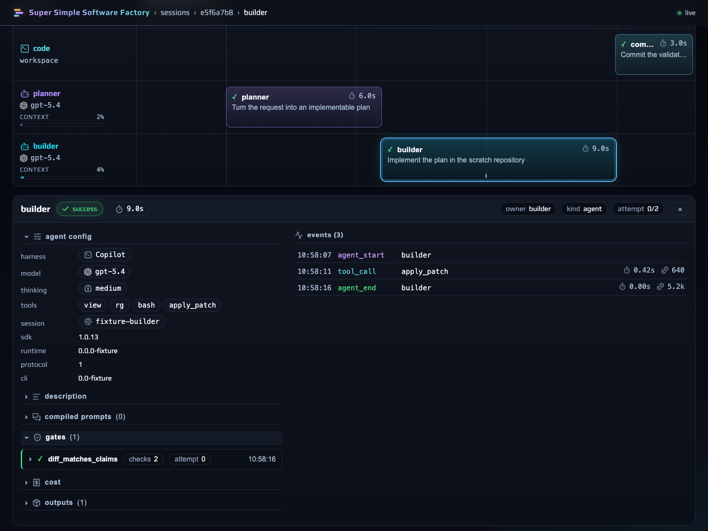

# SSSF First-Time Tutorial: From Zero to a Traced ADW Run

*A guided, hands-on walkthrough for someone who has never run SSSF before.
Verified against this checkout on 2026-09-15. If a command's output differs
from what is shown here, trust your terminal and the linked cookbook/reference
over this page, then fix the mismatch.*

This tutorial is additive to, and does not replace,
[README.md](../README.md) and the [`skills/sssf/` cookbooks and
references](../skills/sssf/SKILL.md). It exists to walk a first-time user
through every step in order, once, with the exact commands this checkout
ships. Once you are comfortable, the cookbooks are the faster reference for
day-to-day work.

## What you'll learn

- What SSSF's deterministic control plane actually does, and where the
  GitHub Copilot worker fits inside it.
- The difference between making the plugin *discoverable* to Copilot and
  *stamping* the runtime into a repository — and why doing one does not do
  the other.
- How to stamp SSSF into a disposable target repository without touching
  this checkout or your real projects.
- How to authenticate, run the SDK/runtime preflight, and execute the
  read-only smoke test.
- What gets generated on disk, and what the default agent roster can and
  cannot write.
- How to run a real two-agent workflow, and what a same-session correction
  looks like when a gate fails.
- How to read a run's evidence back out: `just sessions`/`phases`/`tail`,
  and the underlying SQLite tables and raw JSONL.
- How to run the observability visualizer from your SSSF checkout, pointed
  at a target repository's trace database.
- How to recognize and recover from the most common first-run failures.
- How to clean up afterward, leaving nothing behind but a deleted directory.

## Prerequisites

- Comfortable running shell commands and reading terminal output.
- A basic familiarity with Git (`init`, `commit`, `status`).
- The tools and access listed in [Section 1](#1-prerequisites-and-preflight)
  below, most importantly a GitHub Copilot subscription/access and the
  `copilot` CLI.
- No prior SSSF experience required.

## Time estimate

30–45 minutes if every preflight check passes on the first try; add 10–15
minutes if you need to install a missing tool (Bun for the optional
visualizer is the most common gap).

## What you'll build

By the end you will have a **throwaway** target repository containing a
stamped SSSF factory, a completed traced run with at least two Copilot agent
phases, a SQLite trace you queried directly, and (optionally) the
observability visualizer running against that trace in a browser. You will
then delete the throwaway repository, leaving this checkout untouched.

---

## 1. Prerequisites and preflight

SSSF needs, per [README.md](../README.md) and
[`skills/sssf/SKILL.md`](../skills/sssf/SKILL.md):

- Python 3.11+
- [`uv`](https://docs.astral.sh/uv/)
- Git, and a GitHub Copilot subscription/access
- `sqlite3`
- [`just`](https://just.systems/)
- [`Bun`](https://bun.sh/) — only if you plan to run the visualizer in
  [Section 9](#9-run-the-visualizer-from-your-sssf-checkout)

Check what you already have before going further:

```bash
python3 --version
uv --version
git --version
sqlite3 --version
just --version
copilot --version
bun --version   # optional — skip if you will not run the visualizer
```

Anything missing here will resurface as a specific failure later; fixing it
now is cheaper. See [Section 10](#10-troubleshooting) if a check fails and
the fix isn't obvious.

## 2. Concept: a deterministic control plane around a Copilot worker

SSSF is not "an agent with a system prompt." It is a repeatable
**agents-plus-code** workflow: deterministic Python ADWs (Agentic Developer
Workflows) own sequencing, retries, gates, permissions, evidence, and
acceptance, while GitHub Copilot performs the bounded work that needs
reading, judgement, or code generation. As SKILL.md puts it: *"Copilot
proposes; deterministic code disposes."*


Concretely, one ADW run looks like this:

```text
ADW -> Run.phase -> agents.execute -> Copilot Python SDK -> session/events
                         |              |
                         v              v
                   typed envelopes   SQLite + raw JSONL
```

Every phase is one of three kinds: `engineer` (capturing the human request),
`agent` (one bounded Copilot prompt with a typed output), or `code` (a known,
deterministic command — tests, diffs, migrations, commits). Every run ends
with an explicit `run.finish(accepted=...)`. Read
[`cookbooks/sssf_overview.md`](../skills/sssf/cookbooks/sssf_overview.md) for
the full picture and [`ai_docs/sssf-architecture.md`](../ai_docs/sssf-architecture.md)
for the module-by-module seams; this tutorial only needs the shape above to
make the rest of the steps make sense.

Why bother with the deterministic wrapper at all, instead of just prompting a
capable agent to "do the whole thing"? Because the parts that make a factory
*repeatable* — sequencing, retries, gates, write boundaries, and an
evidence trail — are exactly the parts an agent cannot be trusted to grade
itself on:


## 3. Plugin discovery vs. stamping — two different things

This is the single most common first-time confusion, so it gets its own
section before you run anything. SSSF has **two independent installation
axes**, and doing one does **not** do the other:

1. **Plugin discovery** makes the `sssf` skill visible to a Copilot CLI
   session. It changes nothing in any target repository.
2. **Stamping** copies the SSSF runtime (`adws/`, prompt templates, the
   default roster, `.env.sample`, and a `justfile`) into a *target*
   repository so you can run ADWs there. It does not register anything with
   Copilot's plugin system.



For **published-plugin discovery** (no local checkout involved):

```bash
copilot plugin install bossjones/super-simple-software-factory
copilot plugin list --json   # required discovery evidence
```

For **local plugin development** — validating *this* checkout without
installing it — run from the repository root:

```bash
copilot --no-auto-update --plugin-dir . plugin list --json
```

The listing should show `sssf` as an enabled external plugin.
`copilot skill list --json` is optional diagnostic output only: its
contents, and whether a plugin-provided skill even appears in it, are
CLI-version-dependent. `plugin list --json` is the check that actually
matters. Neither command touches a target repository's files — that's what
[Section 4](#4-install-into-a-safe-disposable-target-repository) does.

## 4. Install into a safe, disposable target repository

Never stamp into this checkout, and never stamp into a repository you care
about while you are still learning the tool. Create a throwaway Git
repository instead:

```bash
mkdir -p /tmp/sssf-tutorial-target
cd /tmp/sssf-tutorial-target
git init -q
git config user.email "you@example.invalid"
git config user.name "SSSF Tutorial"
```

The tutorial initializes Git because ADW Git/commit phases and permission
enforcement expect a target repository. The stamping script itself can copy
files without Git.

From that disposable repo, invoke the installer **from this checkout's
absolute path**. Replace the path below with wherever you actually cloned
or opened this repository:

```bash
SSSF_ROOT="/Users/you/dev/super-simple-software-factory"   # <- adjust this
uv run "$SSSF_ROOT/skills/sssf/scripts/install.py"
```

If you were instead following this tutorial from a *separate* SSSF checkout
you cloned specifically to install elsewhere, the general form from
[`cookbooks/install.md`](../skills/sssf/cookbooks/install.md) is:

```bash
git clone https://github.com/bossjones/super-simple-software-factory.git \
  "$HOME/src/super-simple-software-factory"
uv run "$HOME/src/super-simple-software-factory/skills/sssf/scripts/install.py"
```

The installer prints what it stamped, for example:

```text
sssf Copilot factory installed into /tmp/sssf-tutorial-target
  stamped: <N> file(s)
    + /tmp/sssf-tutorial-target/adws/adw_modules/agent_copilot.py
    ...
    + /tmp/sssf-tutorial-target/.gitignore (+5 entries)

next steps:
  1. cp .env.sample .env   # then set the key(s) your roster needs
  2. just demo             # two cheap read-only runs, end to end
  3. just sessions         # what just happened
```

The installer is **idempotent**: rerunning it skips files that already
exist. It also adds five gitignore entries so runtime state and secrets never
get committed by accident (`adws/adw_data/sessions/`, `adws/adw_data/sssf.db*`,
`.env`, `__pycache__/`, `*.pyc`). Use `--force` only after you have committed
or backed up any local edits to stamped files — it overwrites them. `cd` into
`/tmp/sssf-tutorial-target` for every command in the rest of this tutorial.

## 5. Auth, the preflight doctor, and the read-only `just demo`

Copy the environment template and authenticate:

```bash
cp .env.sample .env
copilot login
```

`copilot login` is preferred. A local, git-ignored `.env` is also an
accepted token store, checked in this exact order:
`COPILOT_GITHUB_TOKEN`, then `GH_TOKEN`, then `GITHUB_TOKEN` — set **at
most one**. Never commit `.env`, and never put a token in a prompt, YAML
file, or CLI argument.

Run the SDK/runtime doctor before your first agent phase (this is the
`copilot-doctor` recipe the stamped `justfile` gives you):

```bash
just copilot-doctor
```

which runs, in order:

```bash
copilot --version
uv run --with github-copilot-sdk==1.0.13 python -c \
  "import importlib.metadata as m; print(m.version('github-copilot-sdk'))"
uv run --with github-copilot-sdk==1.0.13 python -m copilot download-runtime
```

`copilot --version`, the SDK version, and the managed runtime should all be
present and mutually compatible. If anything here fails, stop and read
[Section 10](#10-troubleshooting) before proceeding — every later step
depends on this passing.

Now run the smoke test:

```bash
just demo
```

This runs **two cheap, entirely read-only** ADWs end to end — config
validated, a session minted, an agent ran, its envelope parsed, gates
checked, and a trace written — and changes nothing in your repository:

The terminal prints one line per smoke workflow and ends with a reminder to
run `just sessions`. Keep the `adw_id` printed for each run; you will use it
to inspect the trace in Section 8.

Watch for the line `adw_id: <8-character hex id>` near the top of each run
— you'll use that id to inspect the run in
[Section 8](#8-observe-sessions-phases-tail-and-sqlite-evidence-directly).

## 6. Tour the generated layout and the agent roster

Look at what actually landed on disk:

```bash
find adws -maxdepth 3 -not -path '*/adw_data/sessions*'
```

You should see, matching
[`cookbooks/sssf_overview.md`](../skills/sssf/cookbooks/sssf_overview.md):

```text
adws/
  adw_prompt.py, adw_scout.py, adw_plan.py, adw_plan_build.py, ...
  adw_modules/            # the deterministic control plane
  adw_sssf_config/sssf.config.yaml
  adw_data/
    prompt_engineering/   # one system.md + user.md per starter agent
    sessions/{adw_id}/    # created on first run — this is why it's gitignored
    sssf.db               # created on first run
```

Open the roster:

```bash
cat adws/adw_sssf_config/sssf.config.yaml
```

The stamped roster ships five starter agents, each with a narrow `purpose`
and its own prompt files under `adw_data/prompt_engineering/`:

| Agent | Purpose | `writes` |
|---|---|---|
| `planner` | Turn a request into an implementable plan | `specs/` only |
| `builder` | Implement the plan exactly | unrestricted except protected files |
| `scout` | Find and report where things live | `[]` — read-only |
| `reviewer` | Confirm the build matches the request | `[]` — read-only |
| `documenter` | Write up the change from the diff | `docs/`, `app_docs/`, `*.md` |

`writes` is the authoritative repository write boundary; `tools` (the
model's allowed capabilities) only narrows what an agent *can attempt*, it
does not enforce paths. `protected_files` — by default
`adws/adw_modules/`, `adws/adw_sssf_config/`, and `adws/adw_*.py` — stays off
limits to every agent unless that agent's own `writes` names it explicitly.
Read [`references/config.md`](../skills/sssf/references/config.md) before
changing any of this.

One more small detail worth knowing: each phase records an "engineer" —
the human on whose behalf the run executes. It comes from `ENGINEER_NAME` in
your environment if set, else `git config user.name`, else your OS username.
You'll see it next to every `adw_id:` line SSSF prints.

## 7. Run your first real workflow, and correct it in the same session

`just demo` only ran single-agent, read-only workflows. Now run a two-agent
chain — `planner -> builder -> commit` — with a prompt that follows
[`how_to_prompt_for_the_eng.md`](../skills/sssf/cookbooks/how_to_prompt_for_the_eng.md):
it states the outcome, names the affected path, and defines "done":

```bash
just plan-build "Add a file named NOTES.md at the repository root containing \
one sentence describing this scratch repo. Do not change any other file. \
Done means NOTES.md exists with exactly one sentence."
```


`plan-build` maps to `uv run adws/adw_plan_build.py "..."` (see the stamped
`justfile`'s recipe table if you want the raw form). Its phases are:
`engineer(request) -> planner -> builder -> commit`. Each agent phase parses
one final JSON object against a typed Pydantic envelope
(`PlanOutput`, then `BuildOutput`, both extending `EnvelopeBase`):


If the builder's final message is not valid JSON, SSSF asks it to correct
itself **in the same Copilot session** (its context is intact — this is not
a cold restart), bounded to a couple of automatic attempts. If a gate such
as `diff_matches_claims` fails (the builder claimed changes that don't match
the actual diff), SSSF sends the gate's violation report back into that same
session as a correction and re-checks, up to the phase's configured
`retries`. A malformed-output correction and a gate correction are separate
budgets. Neither path is ever silently turned into a success, and neither
restarts a fresh session — see
[`cookbooks/update_adw.md`](../skills/sssf/cookbooks/update_adw.md) and
[`references/handoff.md`](../skills/sssf/references/handoff.md).

One consequence worth knowing before it surprises you: **changing an
agent's model** in the roster intentionally invalidates that agent's
recorded session, because context built by one model must not be resumed by
another. Changing `reasoning_effort`, `color`, or timeouts does not.

## 8. Observe sessions, phases, tail, and SQLite evidence directly

Take the `adw_id` printed by the run above (or list recent runs first):

```bash
just sessions
```

then drill into one:

```bash
just phases <adw_id>
just tail <adw_id>
just procs <adw_id>
```

These recipes are nothing but small `sqlite3` queries against
`adws/adw_data/sssf.db` — there is no hidden magic. For example, `just tail
<adw_id>` runs:

```sql
select rowid, type, name, started_at from events
where adw_id='<adw_id>' order by rowid desc limit 25;
```

You can run the same kind of query yourself, since the database is
WAL-enabled and safe to read while a run is still writing:

```bash
sqlite3 adws/adw_data/sssf.db \
  "select rowid, type, name, started_at, ended_at from events \
   where adw_id='<adw_id>' order by rowid;"
```


The core tables are `sessions`, `phases`, `events`, `envelopes`,
`gate_results`, `processes`, and `agent_sessions`. Normalized event names you
will see in `events` include `phase_start`/`phase_end`,
`agent_start`/`agent_end`, `tool_call`, `handoff`, `gate_pass`/`gate_fail`,
`log`, and `error`. Gate rows keep every `{item, ok, note}` check, not only
failures, so a green gate stays explainable. Read
[`references/observability.md`](../skills/sssf/references/observability.md)
for the full schema and the redaction guarantees it makes.

The raw evidence lives beside the database, one directory per run:

```text
adws/adw_data/sessions/<adw_id>/
  agent_map.json          # agent name -> Copilot session id + model
  context_handoff/
  <agent>/prompts/, copilot/, raw_output.jsonl, envelope.json
```

Do not hand-edit anything under `adw_data/sessions/`; treat it as read-only
evidence, exactly as [`cookbooks/run_adw.md`](../skills/sssf/cookbooks/run_adw.md)
says.

## 9. Run the visualizer from your SSSF checkout

The visualizer is **not** stamped into a target repository — there is no
target-local visualizer command. It lives only in the SSSF checkout, under
`skills/sssf/apps/visualizer/`, and reads whatever target repository's
`sssf.db` you point it at. Run it from **this checkout** (not from
`/tmp/sssf-tutorial-target`):

```bash
cd "$SSSF_ROOT/skills/sssf/apps/visualizer"
bun install
```

Start the read-only API server in one terminal, pointed at the disposable
target's database:

```bash
bun run server/index.ts --db /tmp/sssf-tutorial-target/adws/adw_data/sssf.db
```

and the dev UI in a second terminal:

```bash
bun run dev
```

Open the URL Vite prints (`http://localhost:4601` by default — the dev
server proxies `/api` to the server on port 4600). The only write the
visualizer server ever makes is a single archive flag on a session row when
you click "archive"; everything else is read-only polling of the same
tables from [Section 8](#8-observe-sessions-phases-tail-and-sqlite-evidence-directly).

The following captures are from the **actual current UI**, taken with the
Playwright CLI against a deterministic disposable SQLite fixture outside this
repository. The fixture contains harmless example IDs, prompts, and version
labels so the screenshots teach the UI without exposing credentials, private
paths, or a real user's request. When you run this section yourself, the
same screens will be populated from your target's real trace.

<figure>
  
  <figcaption><strong>Session list:</strong> scan recent runs, compare their phase timelines, and open a run by selecting its card.</figcaption>
</figure>

<figure>
  
  <figcaption><strong>Trace view:</strong> read the run as ordered lanes—request, agents, and deterministic code—rather than as an opaque chat transcript.</figcaption>
</figure>

<figure>
  
  <figcaption><strong>Phase details:</strong> expand an agent phase to inspect the recorded Copilot/runtime metadata and gate evidence.</figcaption>
</figure>

A conceptual preview of what a run looks like laid out as swim lanes (this
is a design mock-up, not a capture of the live UI):


`just visualizer-build` (defined in this checkout's root `justfile`, not the
stamped one) is the build-only check `just verify` runs in CI; it does not
start the dev server or point at any target database.

## 10. Troubleshooting

| Symptom | What's happening | What to do |
|---|---|---|
| `copilot: command not found`, or `plugin list --json` doesn't show `sssf` | Copilot CLI missing/unauthenticated, or the plugin dir wasn't passed | Install the Copilot CLI, then rerun `copilot --no-auto-update --plugin-dir . plugin list --json` from the checkout root; confirm `plugin.json` and `skills/sssf/SKILL.md` exist |
| Any ADW fails immediately with an auth/login error | No usable credential | Prefer `copilot login`; otherwise set exactly one of `COPILOT_GITHUB_TOKEN` / `GH_TOKEN` / `GITHUB_TOKEN` in a local `.env` (never commit it, never put it in a prompt or CLI argument) |
| `just copilot-doctor` reports a version mismatch, or the runtime fails to download | SDK/CLI/managed-runtime combination is out of sync with the pinned `github-copilot-sdk==1.0.13` | Rerun both `uv run --with github-copilot-sdk==1.0.13 ...` commands verbatim; do not swap in a different SDK version without also updating docs/tests |
| `bun: command not found`, or `just visualizer-build`/`bun install` fails | Bun is optional and only needed for the visualizer | Install Bun from [bun.sh](https://bun.sh/), or simply skip Section 9 — the rest of the factory (install, demo, workflows, `just sessions`/`phases`/`tail`) works without it |
| A phase hangs, or a resumed agent call errors out | `send_and_wait()` only bounds waiting; on a real deadline the runtime calls `session.abort()` explicitly. A resume failure is reported, never silently replaced with a new session | Inspect `just phases <adw_id>`, `just tail <adw_id>`, and `just procs <adw_id>`; verify the PID/command `just procs` shows before terminating it yourself with your OS's process controls; keep the recorded session id in `agent_map.json` for diagnosis rather than editing it |
| A phase or run reports an unauthorized-write rollback, or a `PermissionBreach` | An agent tried to write outside its `writes` pattern or touched a `protected_files` path; SSSF's before/after snapshot rolled it back | Read the gate/changed-path evidence in the trace, then fix the agent's prompt or its `writes` pattern in `sssf.config.yaml` — do not hand-edit envelopes or trace rows |
| `permissions.PermissionBreach: submodules are unsupported by the SSSF write boundary: ...` | The target repo has an indexed Git submodule (a `160000` gitlink entry) | SSSF's write-boundary snapshot fails closed rather than guessing how to roll back a nested repository; keep your disposable target free of submodules, or remove the submodule before running an agent phase |
| `permissions.PermissionBreach: embedded Git repositories are unsupported by the SSSF write boundary: ...` | An **untracked** nested directory containing its own `.git` exists inside the target repo | Same fail-closed behavior as submodules, for the same reason — remove or relocate the nested `.git` directory outside the target repo, then rerun |
| Installer reports fewer stamped files than expected on a rerun | The installer is idempotent by design: existing files are skipped | Use `--force` only after backing up/committing local edits — it overwrites stamped files, including your customizations |

## 11. Cleanup

Stop anything still running: `Ctrl-C` any `bun run server/...` or `bun run
dev` terminal from Section 9, and confirm no ADW process is still active
with `just procs <adw_id>` in the target repo.

Then delete the entire disposable target — sessions, the SQLite trace, and
your test commit all live inside it, and nothing about it was ever pushed
anywhere:

```bash
TARGET=/tmp/sssf-tutorial-target
test "$TARGET" = /tmp/sssf-tutorial-target
rm -rf -- "$TARGET"
```

Do not substitute an unverified path for `TARGET`; check the exact disposable
target before removing it.

If you set a token in a shell environment variable only for this tutorial,
unset it (`unset COPILOT_GITHUB_TOKEN` or equivalent). If you copied a
`.env` you don't want to keep, delete it along with the directory above —
it was git-ignored, so it was never at risk of being committed. Nothing in
this tutorial modified the SSSF checkout you ran the installer from; the
disposable target directory was the only thing that changed.

## Summary

- SSSF's deterministic ADWs own sequencing, gates, write policy, and
  evidence; Copilot performs bounded, typed-envelope work inside that frame.
- Plugin discovery (`copilot plugin install` / `--plugin-dir`) and stamping
  (`install.py`) are independent — check both when something seems missing.
- Always stamp into a disposable or otherwise expendable repository while
  you're learning; the installer and every recipe assume a Git repo.
- `just copilot-doctor` (SDK/runtime preflight) and `just demo` (read-only
  smoke) are the two checks to pass before trusting any real workflow.
- Every run's evidence — sessions, phases, events, envelopes, gates — is
  plain SQLite plus raw JSONL; `just sessions`/`phases`/`tail`/`procs` and
  the visualizer just read it.
- Submodules and untracked embedded Git repositories are unsupported by the
  write boundary and fail closed rather than silently mishandling rollback.

## Next steps

- Add or change a workflow: [`cookbooks/create_adw.md`](../skills/sssf/cookbooks/create_adw.md),
  [`cookbooks/update_adw.md`](../skills/sssf/cookbooks/update_adw.md)
- Tune the roster: [`cookbooks/create_config.md`](../skills/sssf/cookbooks/create_config.md),
  [`cookbooks/update_config.md`](../skills/sssf/cookbooks/update_config.md)
- Extend deterministic modules: [`cookbooks/update_modules.md`](../skills/sssf/cookbooks/update_modules.md)
- Write a better engineer prompt: [`cookbooks/how_to_prompt_for_the_eng.md`](../skills/sssf/cookbooks/how_to_prompt_for_the_eng.md)
- Run bigger chains: `just sdlc "..."` (plan, build, test, commit) and
  `just simple-sdlc "..."` (adds review and docs) — see
  [`cookbooks/run_adw.md`](../skills/sssf/cookbooks/run_adw.md)

## Additional resources

- [`skills/sssf/references/config.md`](../skills/sssf/references/config.md) — full roster schema
- [`skills/sssf/references/handoff.md`](../skills/sssf/references/handoff.md) — envelopes, sessions, corrections
- [`skills/sssf/references/observability.md`](../skills/sssf/references/observability.md) — SQLite schema and event names
- [`ai_docs/README.md`](../ai_docs/README.md) — grounded references on the Copilot CLI, Python SDK, sessions/events, tools/hooks/permissions, and the historical Pi migration
- [Python SDK README](https://github.com/github/copilot-sdk/blob/main/python/README.md), [session persistence](https://github.com/github/copilot-sdk/blob/main/docs/features/session-persistence.md), and [streaming events](https://github.com/github/copilot-sdk/blob/main/docs/features/streaming-events.md) guides — authoritative for version-sensitive SDK behavior

---

*The three PNGs above were captured with the Playwright CLI while the
visualizer API and Vite dev server ran in attached background processes. The
fixture database lived under `/tmp/sssf-tutorial-fixture` and was deleted
after capture; no database, session log, credential, or build output is
committed. The diagrams embedded elsewhere in this page (`images/*.svg`) are
pre-existing repository assets, not screenshots.*
